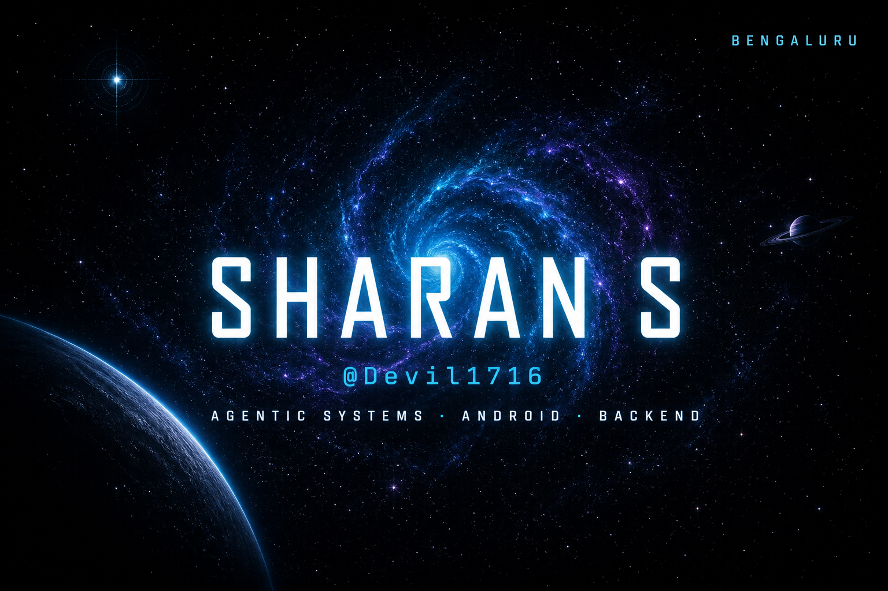
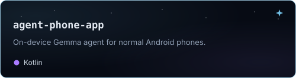
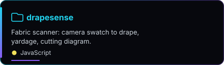
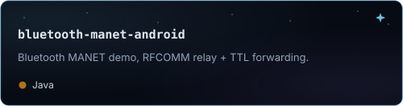
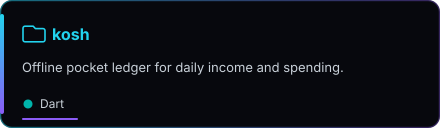
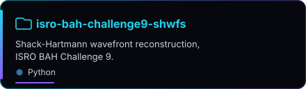
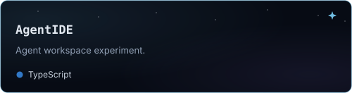

 

B.Tech AI/ML @ Amity University Bengaluru (May 2027)
 
Technical Lead at Quickoo
 
Building on-device agents, Android, FastAPI backends
 
Open to remote Backend / Agentic AI internships

<table>
  <tr>
    <td width="50%" align="center" valign="top">
      
    </td>
    <td width="50%" align="center" valign="top">
      
    </td>
  </tr>
  <tr>
    <td width="50%" align="center" valign="top">
      
    </td>
    <td width="50%" align="center" valign="top">
      
    </td>
  </tr>
  <tr>
    <td width="50%" align="center" valign="top">
      
    </td>
    <td width="50%" align="center" valign="top">
      
    </td>
  </tr>
</table>

<picture>
  <source media="(prefers-color-scheme: light)" srcset="https://raw.githubusercontent.com/Devil1716/Devil1716/output/github-contribution-grid-snake.svg" />
  
</picture>

[LinkedIn](https://www.linkedin.com/in/sharan-s-171816s/) · [sharan071718@gmail.com](mailto:sharan071718@gmail.com)

