 

B.Tech AI/ML @ Amity University Bengaluru (May 2027)
 
Technical Lead at Quickoo
 
Building on-device agents, Android, FastAPI backends
 
Open to remote Backend / Agentic AI internships

<table>
  <tr>
    <td width="50%" align="center" valign="top">
      
       
      On-device Gemma agent for normal Android phones.
    </td>
    <td width="50%" align="center" valign="top">
      
       
      Fabric scanner: camera swatch → drape, yardage, cutting diagram.
    </td>
  </tr>
  <tr>
    <td width="50%" align="center" valign="top">
      
       
      Bluetooth MANET demo — RFCOMM relay + TTL forwarding.
    </td>
    <td width="50%" align="center" valign="top">
      
       
      Offline pocket ledger for daily income and spending.
    </td>
  </tr>
  <tr>
    <td width="50%" align="center" valign="top">
      
       
      Shack-Hartmann wavefront reconstruction — ISRO BAH Challenge 9.
    </td>
    <td width="50%" align="center" valign="top">
      
       
      Agent workspace experiment.
    </td>
  </tr>
</table>

<picture>
  <source media="(prefers-color-scheme: light)" srcset="https://raw.githubusercontent.com/Devil1716/Devil1716/output/github-contribution-grid-snake.svg" />
  
</picture>

[LinkedIn](https://www.linkedin.com/in/sharan-s-171816s/) · [sharan071718@gmail.com](mailto:sharan071718@gmail.com)

